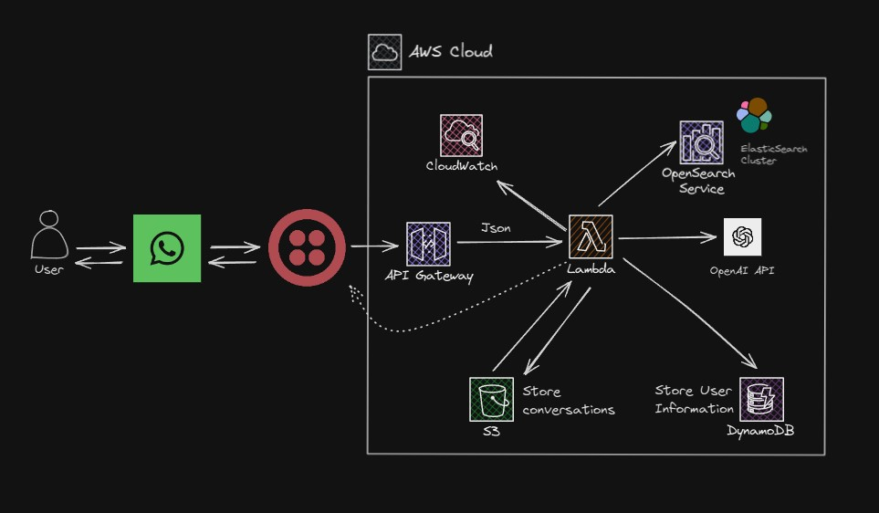

# twilio-ai-integration



Este proyecto contiene código para una aplicación serverless que puedes desplegar con el SAM CLI. Incluye:

- `src` - Código fuente de la función Lambda.
- `events` - Ejemplos de eventos de invocación.
- `test` - Pruebas unitarias.
- `template.yaml` - Plantilla para definir recursos de AWS.

## Requisitos

- [SAM CLI](https://docs.aws.amazon.com/serverless-application-model/latest/developerguide/serverless-sam-cli-install.html)
- [Docker](https://hub.docker.com/search/?type=edition&offering=community)
- [.NET Core](https://www.microsoft.com/net/download)

## Configuración de Entorno

Puedes usar un IDE con AWS Toolkit para desarrollar, depurar y desplegar la aplicación. IDEs soportados: [VS Code](https://docs.aws.amazon.com/toolkit-for-vscode/latest/userguide/welcome.html), IntelliJ, PyCharm, entre otros.

## Configuración de API Keys

Para utilizar esta aplicación, necesitas obtener una API Key de OpenAI y crear una cuenta en Twilio.

1. **Obtener API Key de OpenAI**:
    - Regístrate en [OpenAI](https://beta.openai.com/signup/).
    - Navega a la sección de API Keys y genera una nueva API Key.

2. **Crear cuenta en Twilio**:
    - Regístrate en [Twilio](https://www.twilio.com/try-twilio).
    - Sigue las instrucciones para configurar tu cuenta y obtener tus credenciales de API.

3. **Configurar secretos con `dotnet user-secrets`**:
    - Asegúrate de estar en el directorio del proyecto.
    - Ejecuta los siguientes comandos para almacenar tus API Keys de manera segura:
        ```sh
        dotnet user-secrets init
        dotnet user-secrets set "OPENAI_API_KEY" "TU_API_KEY_DE_OPENAI"
        dotnet user-secrets set "OPENAI_API_KEY_DEV" "TU_API_KEY_DE_OPENAI_DEV"
        dotnet user-secrets set "TWILIO_ACCOUNT_SID" "TU_ACCOUNT_SID_DE_TWILIO"
        dotnet user-secrets set "TWILIO_AUTH_TOKEN" "TU_AUTH_TOKEN_DE_TWILIO"
        ```

## Despliegue

Utiliza el SAM CLI para construir y desplegar la aplicación. Docker es necesario para ejecutar funciones Lambda localmente.

### Pasos para el despliegue

1. Clona el repositorio:
    ```sh
    git clone https://github.com/tu-usuario/twilio-ai-integration.git
    cd twilio-ai-integration
    ```

2. Construye la aplicación:
    ```sh
    sam build
    ```

3. Despliega la aplicación:
    ```sh
    sam deploy --guided
    ```

## Estructura del Proyecto

- **`.aws-sam/`**: Carpeta generada por el SAM CLI que contiene los artefactos de construcción y despliegue.
- **`events`**: Contiene ejemplos de eventos de invocación para probar la función Lambda.
- **`src`**: Contiene el código fuente de la función Lambda.
  - **`TwilioAIIntegration/`**: Carpeta principal del proyecto que incluye:
    - **`ElasticSearchService.cs`**: Servicio para interactuar con Elasticsearch.
    - **`MessageProcessor.cs`**: Clase principal que maneja las solicitudes.
    - **`OpenAIService.cs`**: Servicio para interactuar con OpenAI.
    - **`StorageService.cs`**: Servicio para guardar conversaciones entre el usuario y la Lambda.
- **`template.yaml`**: Plantilla para definir los recursos de AWS.
- **`test`**: Contiene las pruebas de integracion para la función Lambda.
  - **`TwilioAIIntegration.Tests/`**: Carpeta de pruebas que incluye:
    - **`FunctionTest`**: Clase para ejecutar test.

## Pruebas

Para ejecutar las pruebas unitarias, utiliza el siguiente comando:

```sh
dotnet test
```

## Aun queda...

- Agregar informacion del usuario a DynamoDB
- Agregar soporte para imagen y audio
- Agregar servicio de ElasticSearch a AWS (cluster de Amazon OpenSearch), es decir al template.yaml
- Mucho refactor...

